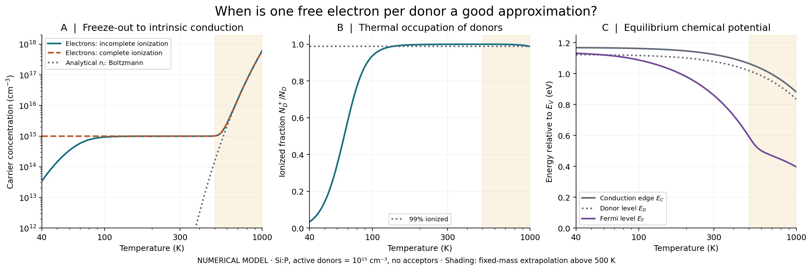
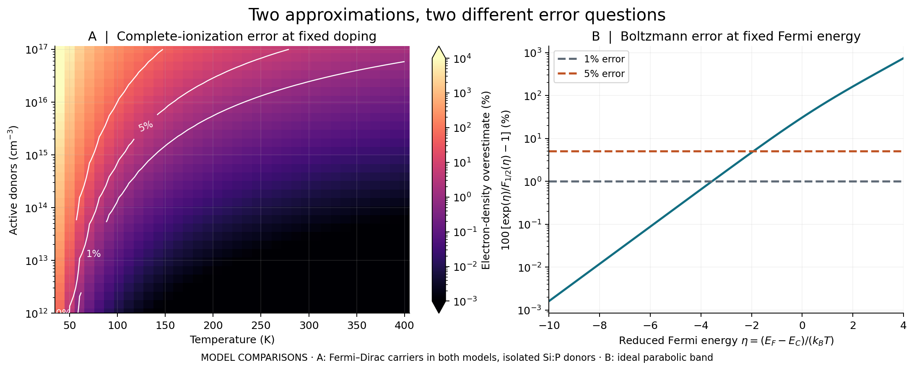
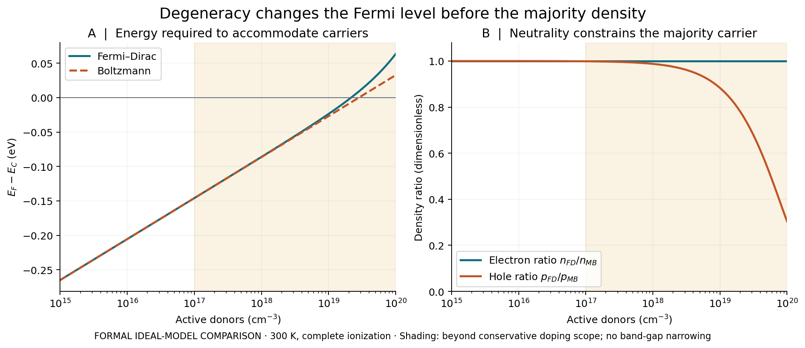

# Semiconductor Carrier Statistics

**Solve equilibrium carrier populations in silicon and measure when Boltzmann statistics or complete dopant ionization become inaccurate.**



*Numerical model: uniform Si:P with active donors of 10¹⁵ cm⁻³. The shaded region is a qualitative fixed-mass extrapolation. No experimental measurements are plotted.*

## Why this project exists

The approximation “one electron per donor” fails during freeze-out. Boltzmann statistics fail when carriers become degenerate. These are separate assumptions, and changing them can affect different observables. This package solves charge neutrality consistently, then compares the assumptions through reproducible parameter studies.

The central questions are: **How many carriers are available? Where is the Fermi level? How much error does a simpler model introduce?**

## Physics

For a uniform, unstrained silicon crystal at thermal equilibrium:

$$
n=N_C F_{1/2}\left(\frac{E_F-E_C}{k_BT}\right),\qquad
p=N_V F_{1/2}\left(\frac{E_V-E_F}{k_BT}\right)
$$

$$n+N_A^-=p+N_D^+.$$

Here, $n,p$ are carrier concentrations; $N_C,N_V$ are effective densities of states; $N_D^+,N_A^-$ are ionized dopant concentrations; and $E_F,E_C,E_V$ are the Fermi level and band edges. Concentrations use cm⁻³, energies eV and temperature K. The energy reference is $E_V=0$.

The model combines a Varshni band gap, fixed parabolic-band effective masses, and isolated phosphorus/boron dopant levels. It uses the **normalized** Fermi integral. [Model derivation, symbols, parameters and sources](docs/model.md) explain the assumptions and degeneracy conventions.

## Features

- Electron/hole populations, Fermi level, and neutral/ionized dopant densities.
- Independent choices of Fermi–Dirac/Boltzmann statistics and incomplete/complete ionization.
- Adaptive quadrature and a bracketed nonlinear equilibrium solver.
- Charge-balance arithmetic that remains sensitive under exact compensation.
- Three reproducible figure studies, four CSV tables, and a JSON validation report.
- Python API and command-line JSON output; NumPy and SciPy are the only core dependencies.

## Example results

For Si:P with 10¹⁵ cm⁻³ active donors, no acceptors, and incomplete ionization:

| Quantity | Numerical model result |
|---|---:|
| Ionized donor fraction at 40 K | 3.46365% |
| Electron density at 300 K | 9.99588 × 10¹⁴ cm⁻³ |
| Fermi level at 300 K, relative to valence edge | 0.858992 eV |
| Band gap at 300 K | 1.124019 eV |

At a **fixed Fermi energy**, the Boltzmann electron-density error reaches 1% at reduced energy $\eta\approx-3.560$ and 5% at $\eta\approx-1.930$. These thresholds describe a parabolic-band statistics comparison, not universal doping thresholds.



At fixed, fully ionized donor density, both statistics models give approximately $n=N_D$. Their Fermi levels and minority-carrier densities differ:



*The shaded high-doping region is a formal ideal-model comparison. It is not a quantitative prediction for heavily doped silicon.*

## Installation

Python 3.11 or newer. From this repository's root directory:

```bash
python -m venv .venv
source .venv/bin/activate
python -m pip install -e ".[plots,dev]"
```

On Windows PowerShell, activate with `.venv\Scripts\Activate.ps1`. For the numerical API alone, install with `python -m pip install -e .`. Dependencies are defined once in `pyproject.toml`.

## Usage

```python
from carrier_stats import solve_equilibrium

result = solve_equilibrium(
    temperature_K=300,
    donor_cm3=1e15,
    acceptor_cm3=0,
    statistics="fermi-dirac",
    ionization="incomplete",
)
print(result.electron_cm3)
print(result.fermi_level_eV)
print(result.neutrality_relative_residual)
```

```bash
python -m carrier_stats --temperature 100 --donors 1e15
python -m carrier_stats --temperature 300 --acceptors 1e16 --statistics boltzmann
python examples/build_figures.py
python examples/validate_model.py
```

The example commands write to ignored `outputs/`. To reproduce the committed assets:

```bash
python examples/build_figures.py --output .
python examples/validate_model.py --output docs/validation.json
python -m pytest -q
python -m ruff check .
python -m ruff format --check .
```

No dashboard is required: the API, readable examples, and saved figures expose the model directly.

## Validation

**Numerical verification and physical validation are different.** This release verifies the equations and numerical methods; it has not been calibrated against an experimental temperature sweep.

- 130 automated tests cover analytical solutions, both dopant types, compensation, conservation, asymptotic statistics, quadrature convergence, input errors, and the CLI.
- An independent report evaluates 192 equilibrium cases. Maximum reduced charge residual: **5.96 × 10⁻¹¹**.
- The numerical Boltzmann/complete-ionization solution agrees with its analytical quadratic to **1.23 × 10⁻¹¹** maximum relative error on that report grid.
- Fermi-integral checks include a zeta-function identity, an independent integration variable, and the Sommerfeld limit.

These small errors describe numerical consistency, **not uncertainty in real silicon**. [Validation methods and reproduced values](docs/validation.md) include the test environment, tolerances, and a numerical defect caught during development. CI is configured to run tests and reports on pushes and pull requests; only completed runs should be interpreted as passing.

## Project structure

| Path | Purpose |
|---|---|
| `src/carrier_stats/` | Material model, Fermi integral, equilibrium solver, CLI |
| `tests/` | Scientific and software behavior tests |
| `examples/` | Figure/data generation and validation report |
| `data/` | Generated CSV results with provenance and units |
| `figures/` | PNG previews and SVG figures |
| `docs/` | Model derivation, validation, learning/interview notes |
| `.github/workflows/ci.yml` | Automated verification configuration |

## Limitations

- Homogeneous bulk equilibrium only: no junctions, fields, contacts, current, or illumination.
- Fixed effective masses and parabolic bands; no band-gap narrowing or dopant interactions.
- Isolated, single-level dopants; active substitutional density is an input, not an implantation dose or measured activation yield.
- Accepted input range: 40–1000 K and 0–10²⁰ cm⁻³ per dopant species. Numerical acceptance does not establish physical validity.
- Warnings and result metadata mark total doping above 10¹⁷ cm⁻³ and temperatures above 500 K. These conservative project boundaries are not universal material transitions.
- The model gives analytical Boltzmann $n_i\approx6.16\times10^9$ cm⁻³ at 300 K. That value follows this fixed-mass parameter set; it should not be substituted for an experimentally calibrated intrinsic-density model.

## Future work

1. Add a separately validated temperature-dependent density-of-states parameterization.
2. Compare with a licensed Hall-effect dataset with known compensation and Hall-factor treatment.
3. Introduce dopant interactions only alongside a documented physical model and independent benchmarks.

## References and data provenance

- [NIST DLMF §25.12](https://dlmf.nist.gov/25.12): normalized Fermi–Dirac integral.
- V. Palankovski, *Simulation of Heterojunction Bipolar Transistors* (2000): [band gap](https://www.iue.tuwien.ac.at/phd/palankovski/node37.html), [effective masses](https://www.iue.tuwien.ac.at/phd/palankovski/node40.html), [density of states](https://www.iue.tuwien.ac.at/phd/palankovski/node41.html).
- J. S. Smith et al. (2016), [phosphorus donor energy levels in silicon](https://arxiv.org/abs/1612.00569).
- F. Meng et al. (2023), [higher-harmonic generation in boron-doped silicon](https://arxiv.org/abs/2303.01564): boron binding-energy parameter, not validation data for this project.
- J. A. Mol et al. (2015), [acceptor degeneracy in silicon](https://arxiv.org/abs/1501.05669).

All plots and CSV tables were generated by this software. Published scalar parameters are cited as reference inputs; no external measurement dataset or third-party code is redistributed. Original code, documentation and generated assets are provided under the [MIT license](LICENSE).

This initial implementation was developed with AI assistance. [Learning notes](docs/learning.md) identify the derivations and implementation decisions a maintainer should understand before describing personal contributions in an interview.
